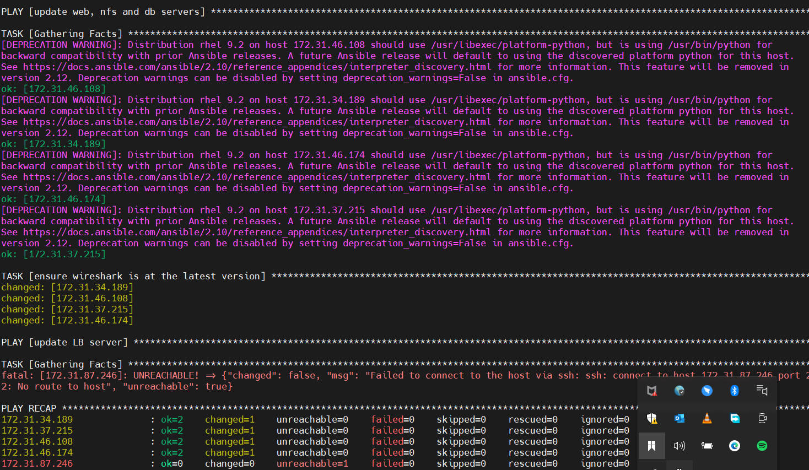

# Ansible-config-management

In this project, i will run a jenkins pipeline to configure my web server, database and NFS using ansible. the architecture diagram is as shown below.


I already have my jenkins setup and configured on this server.


To configure ansible, run the following command 
`sudo apt update` and `sudo apt install ansible`

After the installation is complete. confirm the setup by running `ansible --version`


i have created a new repository called `ansible-config-management` and also created a branch called `feature-ansible-deploy`. lets checkout the code to our local system openn with vscode.

create two folders inventory and playbooks
create the following files under the  `inventory folder`, dev,uat,staging,prod.
create a file named ``common.yaml`` under the playbooks folder


add the ssh key to 
``ssh-add dev_key.pem``

## Setting Up Inventory

let's update the dev file in the inventory folder with the below code.
```
[nfs]
172.31.34.189 ansible_ssh_user=ec2-user

[webservers]
172.31.37.215 ansible_ssh_user=ec2-user
172.31.46.174 ansible_ssh_user=ec2-user

[db]
172.31.46.108 ansible_ssh_user=ec2-user 

[lb]
172.31.87.246 ansible_ssh_user=ubuntu

```
lets also update our common.yaml file with the below code.

```
---
- name: update web, nfs and db servers
  hosts: webservers, nfs, db
  become: yes
  tasks:
    - name: ensure wireshark is at the latest version
      yum:
        name: wireshark
        state: latest
   

- name: update LB server
  hosts: lb
  become: yes
  tasks:
    - name: Update apt repo
      apt: 
        update_cache: yes

    - name: ensure wireshark is at the latest version
      apt:
        name: wireshark
        state: latest

```


let's commit and push the updated script to our git repository.
```
git status

git add .

git commit -m "commit message"
```

We can confirm the ansible playbook successfully executed the playbook scripts by confirming wireshack was installed on the target servers by inputing the command ``wireshark -v``.


This confirms we have been able to use ansible to deploy artifacts to target servers.

